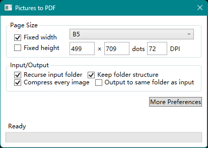

# PicMergeToPdf

Merge-Picutes-to-PDF is an application that allow you to drag-drop image files and/or folders in and merge them with or without compression into seperate PDF files.

## Usage

 - Change preferences on this app's window.
 - Drag some images or folders containing images.
 - Drop them into this app's window. There may be a dialog for destination.
 - Process is on! Just wait.

## Defects

 - Globalization is to be done.
 - Compression preferences are to be done.
 - Icon of this project is to be done.

## Screenshot

