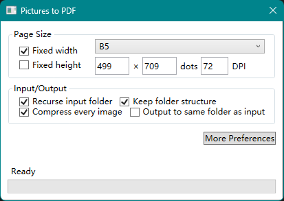
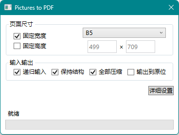

# Merge Picutes to PDF

Merge-Picutes-to-PDF is an application that allows you to drag-drop images and/or 
folders in 

and merge them with/without compression into seperate PDF files.

## Usage

- Change preferences on this app's window.
- Drag some images or folders containing images.
- Drop them into this app's window. There may be a dialog for destination.
- Process is on! Just wait.

## License

GNU AFFERO GENERAL PUBLIC LICENSE Version 3

See [LICENSE.txt](LICENSE.txt).

## Screenshots

